# Smart Agriculture Monitoring and Irrigation System 🌱

## Soil Moisture Sensor Investigation

This is the first phase of the Smart Agriculture Monitoring and Irrigation System.

The objective is to understand sensor behaviour, collect measurements, perform calibration, and prepare the sensor for future IoT integration.

## Hardware

- ESP32 Development Board
- Soil Moisture Sensor
- Breadboard
- Jumper Wires
- USB Cable

## Hardware Setup


## Wiring Diagram


## Serial Monitor Output


## Sensor Working Principle

The soil moisture sensor measures changes in electrical conductivity caused by water content in soil.

The sensor output is converted into an ADC value by the ESP32.


## Calibration Experiment

The sensor was tested under different soil conditions.

| Condition | ADC Value Range |
|---|---|
| Dry soil | 0-200 |
| Moist soil | 200-1000 |
| Wet soil | Above 1000 |


## Observations

- ADC values increased when soil moisture increased.
- Multiple readings were averaged to reduce sensor noise.
- Calibration values were obtained experimentally.


## Software

- Visual Studio Code
- PlatformIO
- Arduino Framework
- C++


## Current Status

Completed:
- Sensor connection
- Data collection
- Calibration
- ESP32 implementation


## Future Work

- Add temperature and humidity monitoring
- Add water level monitoring
- Control irrigation pump automatically
- Send data through WiFi
- Store data in database
- Apply machine learning for irrigation prediction


## 2. DHT11 Temperature and Humidity Sensor

### Objective

The DHT11 sensor was investigated to understand its temperature and relative humidity measurements, short-term stability, response to environmental changes, and recovery behavior.

The sensor was tested independently using an ESP32 before integrating it with the complete Smart Agriculture Monitoring and Irrigation System.

### Hardware

* **Microcontroller:** ESP32
* **Sensor:** DHT11
* **Temperature unit:** °C
* **Humidity unit:** %RH
* **Communication:** Digital
* **DHT11 DATA pin:** GPIO 17

### DHT11 Wiring

The DHT11 was connected to the ESP32 as follows:

| DHT11 Pin | ESP32   |
| --------- | ------  |
| VCC       | 3.3V    |
| DATA      | GPIO 17 |
| GND       | GND     |

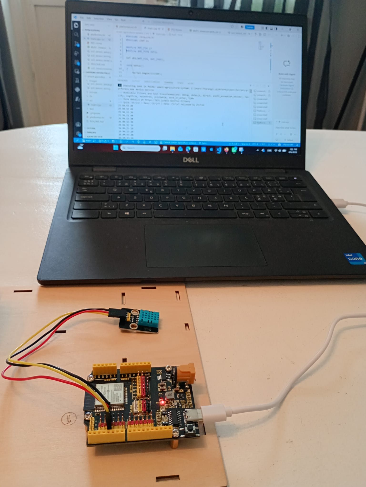


### Software

The DHT11 was programmed using PlatformIO and the Arduino framework.

The following libraries were used:

* DHT sensor library
* Adafruit Unified Sensor

The sensor was configured as:

```cpp
#define DHT_PIN 17
#define DHT_TYPE DHT11
```

The ESP32 reads temperature and relative humidity from the DHT11 at a sampling interval of approximately 2 seconds.

### Data Format

The sensor output was changed to a CSV-compatible format to simplify data collection and later analysis:

```text
Temperature_C,Humidity_RH
25.80,53.40
25.90,53.40
25.90,53.30
```

### Serial Monitor Output

The DHT11 measurements were observed through the PlatformIO Serial Monitor.

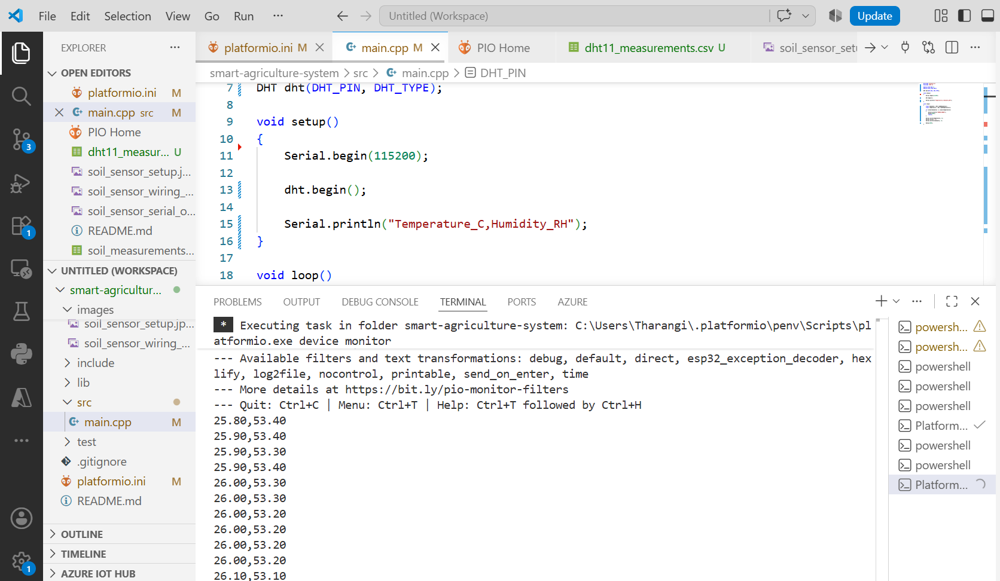

---

## DHT11 Experiments

Two experiments were performed to characterize the behavior of the sensor.

### Experiment 1 — Stable Room Conditions

#### Objective

The first experiment investigated the short-term stability of the DHT11 under relatively stable indoor room conditions.

#### Procedure

The DHT11 was left undisturbed while temperature and relative humidity measurements were collected.

The collected measurements are stored in:

`data/dht11/experiment1_stable.csv`

#### Initial Observation

The measurements showed highly stable temperature readings during the observation period. Relative humidity showed only small short-term fluctuations.

The initial analysis showed:

| Measurement           |     Result |
| --------------------- | ---------: |
| Temperature minimum   |   26.70 °C |
| Temperature maximum   |   26.70 °C |
| Temperature variation |    0.00 °C |
| Humidity minimum      |  52.30 %RH |
| Humidity maximum      |  52.60 %RH |
| Humidity variation    |   0.30 %RH |
| Average humidity      | ≈52.46 %RH |

#### Interpretation

The results indicate that the sensor produced stable repeated measurements under relatively stable environmental conditions.

However, stability should not be interpreted as measurement accuracy. This experiment evaluates short-term consistency rather than absolute accuracy because no calibrated reference instrument was used.

---

### Experiment 2 — Environmental Response and Recovery

#### Objective

The second experiment investigated how the DHT11 responds to a temporary environmental disturbance and how its measurements change after the disturbance is removed.

#### Experimental Procedure

The experiment was divided into three phases:

| Phase                      |     Time | Condition                                |
| -------------------------- | -------: | ---------------------------------------- |
| Phase 1 — Normal           |  0–3 min | Sensor left undisturbed                  |
| Phase 2 — Hand near sensor |  3–5 min | Hand placed near the sensor              |
| Phase 3 — Recovery         | 5–10 min | Hand removed and sensor left undisturbed |

The sampling interval was approximately **2 seconds**. A total of **299 measurements** were collected over approximately **9 minutes 56 seconds**.

The complete dataset is stored in:

`data/dht11/experiment2_response_recovery.csv`

#### Statistical Results


| Phase | Temperature Min (°C) | Temperature Max (°C) | Temperature Average (°C) | Humidity Min (%RH) | Humidity Max (%RH) | Humidity Average (%RH) |
|---|---:|---:|---:|---:|---:|---:|
| Normal | 25.8 | 26.4 | 26.277 | 52.4 | 53.4 | 52.694 |
| Hand near sensor | 26.4 | 27.1 | 26.787 | 52.4 | 65.7 | 61.953 |
| Recovery | 26.6 | 27.1 | 26.852 | 53.1 | 61.4 | 54.100 |


#### Temperature Response

During the normal phase, the average temperature was approximately **26.277 °C**. When the hand was placed near the sensor, the temperature increased and reached a maximum of **27.1 °C**.

The maximum temperature increase relative to the normal-phase average was approximately:

**27.1 − 26.277 = 0.823 °C**

During the recovery phase, the temperature gradually moved toward the initial room condition, reaching approximately **26.7 °C** at the end of the experiment.

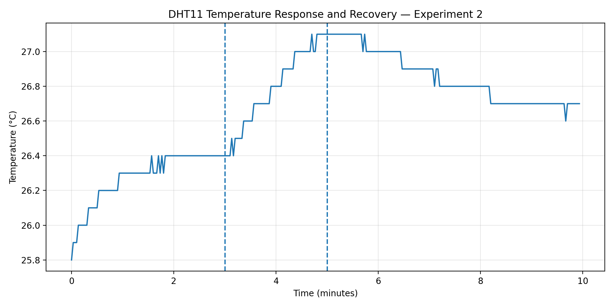

#### Humidity Response

The normal-phase average relative humidity was approximately **52.694 %RH**.

When the hand was placed near the sensor, humidity increased substantially and reached a maximum of **65.7 %RH**.

The maximum increase relative to the normal-phase average was approximately:

**65.7 − 52.694 = 13.006 percentage points**

After the hand was removed, the humidity gradually decreased toward the original environmental condition. The final measurement was approximately **53.4 %RH**.

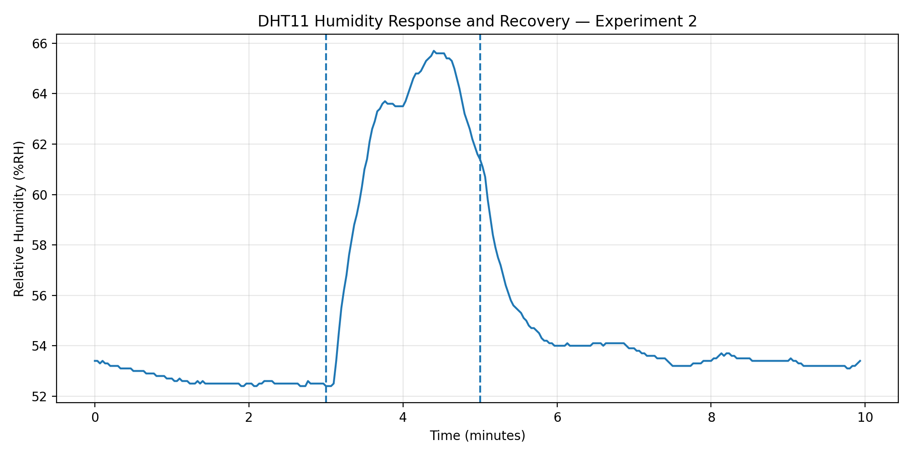

#### Engineering Interpretation

The experiment demonstrated that the DHT11 responds measurably to a temporary environmental disturbance.

The temperature increased by approximately **0.823 °C** relative to the normal-phase average, while relative humidity increased by approximately **13.006 percentage points**. The humidity response was considerably more pronounced than the temperature response.

After the hand was removed, both measurements gradually moved toward the original environmental conditions. This demonstrates the sensor's environmental response and recovery behavior.

The results indicate that the DHT11 can detect short-term changes in temperature and relative humidity and therefore has potential for environmental monitoring in the Smart Agriculture system.

However, these experiments demonstrate **sensor response and short-term behavior, not absolute measurement accuracy**. Accuracy would require comparison against a calibrated reference instrument.

#### Data Analysis Files

The processed data and statistical results are available in:

```text
data/dht11/
├── experiment1_stable.csv
└── experiment2_response_recovery.csv
```

The analysis produced:

* Temperature vs. Time graph
* Humidity vs. Time graph
* Phase-by-phase minimum, maximum, average, and range
* Response magnitude relative to the normal baseline
* Recovery observations


### Experiment 3 — Environmental Variation at Different Locations

#### Objective

The third experiment investigated how the DHT11 temperature and humidity sensor responds to different environmental conditions by testing the sensor at two different locations.

The purpose was to determine whether the sensor measurements change when the surrounding environmental conditions change and to observe the stability of the measurements at each location.

#### Experimental Procedure

The experiment was performed in two locations:

| Phase      |     Time | Location   | Condition                                 |
| ---------- | -------: | ---------- | ----------------------------------------- |
| Location A |  0–5 min | Location A | Sensor placed at the first test location  |
| Location B | 5–20 min | Location B | Sensor moved to a different room/location |

The sensor was connected to the ESP32 and measurements were collected continuously.

The sampling interval was approximately **2 seconds**.

A total of **602 measurements** were collected:

* **Location A:** 150 measurements
* **Location B:** 452 measurements

The complete dataset is stored in:

`data/dht11/experiment3_different_location.csv`

#### Results

The measurements showed clear differences between the two locations.

At **Location A**, the temperature remained approximately between **25.1 °C and 25.3 °C**, while relative humidity was approximately between **47.4 %RH and 48.0 %RH**.

After the sensor was moved to **Location B**, the temperature decreased gradually. The measurements reached approximately **24.1 °C**, showing that Location B was cooler than Location A.

The humidity at Location B remained relatively stable, generally around **47.9–48.2 %RH**.

#### Statistical Analysis

The main statistics considered in this experiment were the minimum, maximum, average, and range of the temperature and humidity measurements.

| Location   | Measurement      | Minimum | Maximum | Range | Average |
| ---------- | ---------------- | ------: | ------: | ----: | ------: |
| Location A | Temperature (°C) |   25.10 |   25.30 |  0.20 |  ≈25.20 |
| Location A | Humidity (%RH)   |   47.40 |   48.00 |  0.60 |  ≈47.75 |
| Location B | Temperature (°C) |   24.10 |   24.80 |  0.70 |  ≈24.30 |
| Location B | Humidity (%RH)   |   47.70 |   48.20 |  0.50 |  ≈47.98 |

> **Note:** The averages are calculated from the collected measurements and may be displayed rounded to two decimal places.

#### Observations

At Location A, the temperature remained relatively stable during the first five minutes, with only a small variation between approximately 25.1 °C and 25.3 °C.

When the sensor was moved to Location B, the temperature decreased noticeably. The temperature gradually changed from approximately 24.7–24.8 °C to approximately 24.1 °C.

The humidity showed much less variation compared with the temperature. At Location A, humidity gradually decreased from approximately 48.0 %RH to around 47.4 %RH. At Location B, humidity remained relatively stable around 47.9–48.2 %RH.

These results demonstrate that the DHT11 can detect differences in environmental temperature between locations.

#### Engineering Interpretation

The experiment demonstrated that the DHT11 measurements are affected by the surrounding environmental conditions.

The most significant change was observed in temperature. Location A was warmer, with measurements around **25.1–25.3 °C**, whereas Location B produced lower temperature measurements, reaching approximately **24.1 °C**.

The humidity measurements showed considerably smaller changes. This indicates that the humidity conditions at the two locations were relatively similar even though their temperatures differed.

The gradual temperature change after moving the sensor also demonstrates that the DHT11 does not necessarily change immediately to the final environmental value. The sensor requires some time to respond to and stabilize under the new environmental conditions.

This behavior is important for the Smart Agriculture Monitoring and Irrigation System because environmental sensors may need a stabilization period after installation or movement before their measurements are interpreted by the monitoring or machine-learning components.

As with the previous experiments, this experiment does **not establish the absolute measurement accuracy** of the DHT11 because the sensor was not compared against a calibrated reference instrument.

#### Experiment 3 Graphs

**Temperature vs. Time**

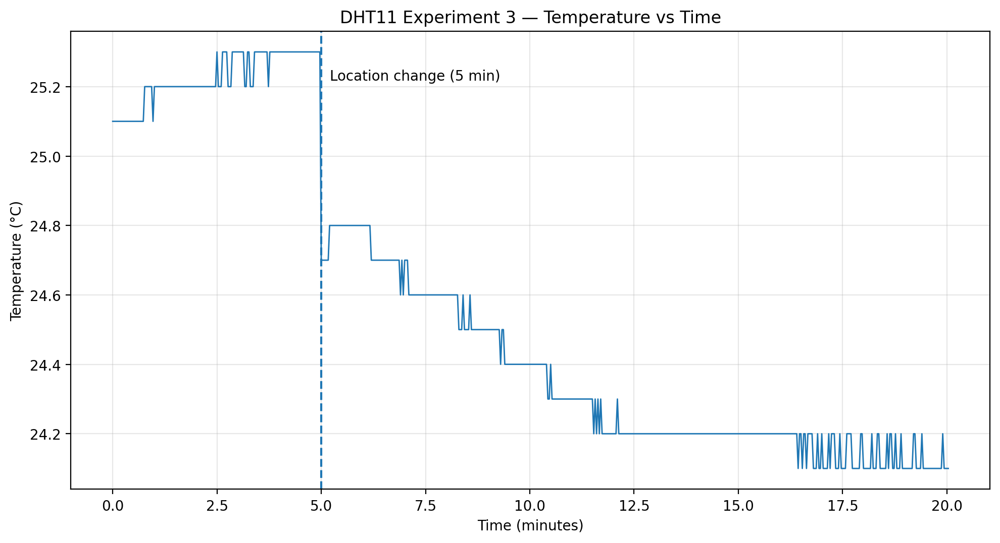

**Humidity vs. Time**

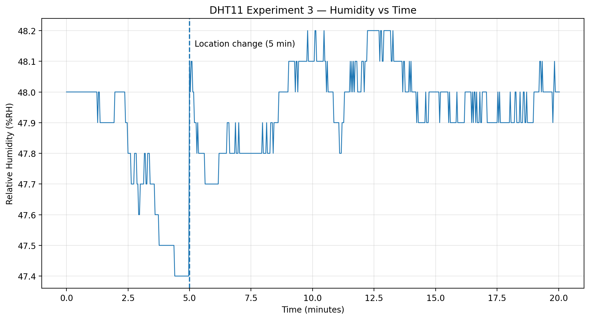

The graphs show the temperature and humidity measurements throughout the experiment. The transition from **Location A to Location B occurred at approximately 5 minutes**.

#### Dataset

The complete experimental dataset is available at:

`data/dht11/experiment3_different_location.csv`

The dataset contains the following columns:

```text
Temperature_C,Humidity_RH
```

#### DHT11 Characterization Status

* [x] Understand DHT11 operation
* [x] Connect DHT11 to ESP32
* [x] Collect stable-condition measurements
* [x] Test environmental response
* [x] Test recovery behavior
* [x] Test sensor at different locations
* [x] Analyze temperature and humidity variation
* [x] Generate temperature and humidity graphs

The results from these experiments provide an initial characterization of the DHT11 sensor before integrating it into the complete Smart Agriculture Monitoring and Irrigation System.


## 3. LDR Light Sensor

### Objective

The LDR sensor was investigated to understand how its analog output changes with different light conditions, including stable room lighting, darkness, and bright light.

The sensor was tested independently using an ESP32 before integrating it with the complete Smart Agriculture Monitoring and Irrigation System.

### Hardware

* **Microcontroller:** ESP32
* **Sensor:** Photoresistor (LDR)
* **Measurement:** Analog light intensity
* **Output:** ADC value
* **ADC resolution:** 12-bit
* **ADC range:** 0–4095
* **Communication:** Analog
* **LDR ADC pin:** GPIO 34

### LDR Wiring

The photoresistor circuit was connected to the ESP32 analog input. The ESP32 reads the voltage produced by the LDR circuit using its ADC.

| LDR Circuit | ESP32 |
| ----------- | ----- |
| VCC         | 3.3V  |
| Analog OUT  | GPIO 34 |
| GND         | GND   |

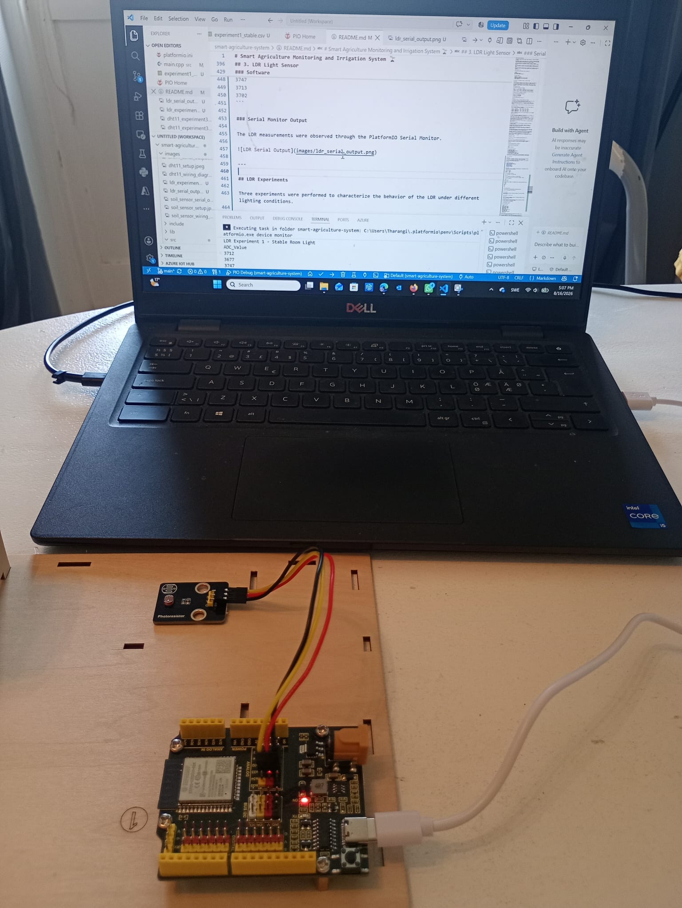

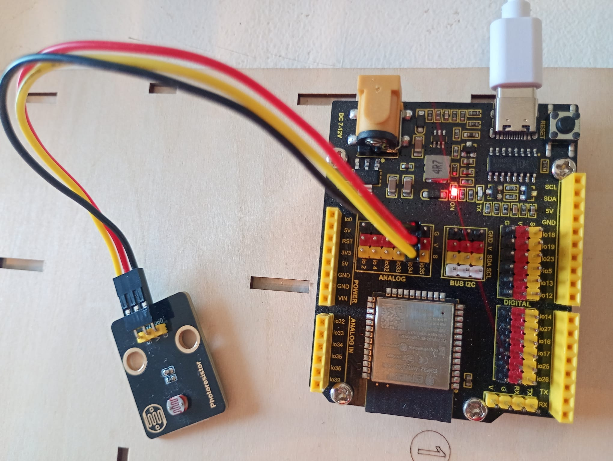

### Software

The LDR was programmed using PlatformIO and the Arduino framework.

The ESP32 reads the analog value from the LDR using the `analogRead()` function.

The sensor was configured as:

```cpp
#define LDR_PIN 34
```
### Data Format

The sensor output was changed to a CSV-compatible format to simplify data collection and later analysis:

```text
ADC_Value
3712
3677
3747
3713
3702
```

### Serial Monitor Output

The LDR measurements were observed through the PlatformIO Serial Monitor.

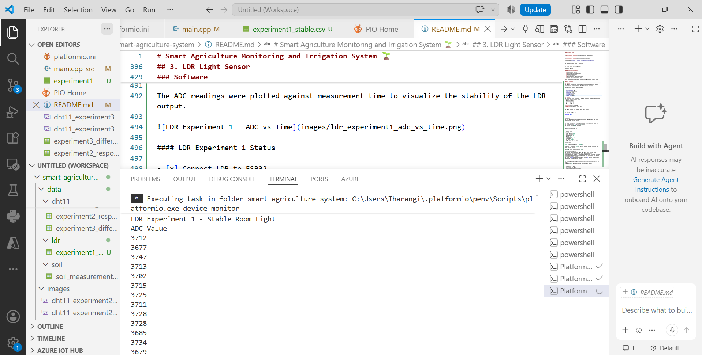

---

## LDR Experiments

Three experiments were performed to characterize the behavior of the LDR under different lighting conditions.


### LDR Experiment 1 — Stable Room Light

#### Objective

The first LDR experiment investigated the stability of the ESP32 ADC readings under normal, relatively stable room-light conditions.

#### Experimental Procedure

The LDR was connected to the ESP32 and positioned under normal room lighting. The ADC value was recorded continuously for approximately 10 minutes.

The experiment produced 603 ADC measurements.

The complete dataset is stored in:

`data/ldr/experiment1_stable.csv`

#### Statistical Results

| Parameter | Result |
|---|---:|
| Number of readings | 603 |
| Minimum ADC value | 3515 |
| Maximum ADC value | 3747 |
| Average ADC value | 3635.06 |
| Median ADC value | 3634 |
| ADC range | 232 |
| Standard deviation | 42.72 |
| Coefficient of variation | 1.18% |
| First reading | 3712 |
| Last reading | 3659 |
| Change, first → last | -53 ADC |
| Percentage change | -1.43% |

#### Observations

During the stable-room-light experiment, the LDR produced ADC values between **3515 and 3747**, with an average ADC value of **3635.06**.

The readings remained within a relatively narrow range throughout the experiment. The coefficient of variation was **1.18%**, indicating relatively stable ADC output under the tested room-light condition.

The first reading was **3712** and the final reading was **3659**, corresponding to a decrease of **53 ADC counts**, or approximately **1.43%**.

#### Engineering Interpretation

The experiment demonstrates that the LDR and ESP32 ADC can provide relatively stable measurements when the lighting environment remains approximately constant.

However, ADC stability should not be interpreted as light-measurement accuracy. The experiment does not establish an absolute relationship between ADC value and illuminance (lux), because no calibrated light meter was used.

The results from this experiment will be used as a baseline for comparison with measurements obtained under dark and bright-light conditions.

#### Graph

The ADC readings were plotted against measurement time to visualize the stability of the LDR output.

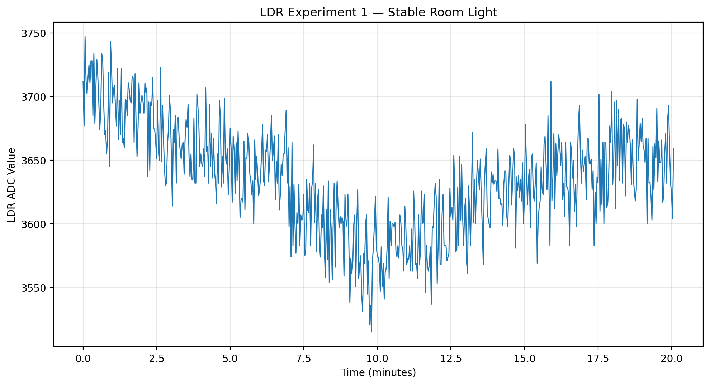


### Experiment 2 — Covered/Dark Condition

#### Objective

The second experiment investigated how the LDR ADC output changes when the photoresistor is exposed to a very low-light or dark condition.

The purpose was to compare the dark-condition response with the normal room-light baseline obtained in Experiment 1.

#### Experimental Procedure

The photoresistor was completely covered to prevent room light from reaching the sensor.

The ADC value was then recorded using the ESP32.

The sampling interval was approximately **1 second**, and approximately **5 minutes** of measurements were collected.

The complete dataset is stored in:

`data/ldr/experiment2_dark.csv`

#### Observations

During the covered/dark condition, the LDR produced an ADC value of **0 throughout the experiment**.

A total of **303 readings** were collected.

The recorded ADC values were:

- Minimum: **0**
- Maximum: **0**
- Average: **0.00**
- Range: **0**

This indicates that the LDR circuit produced a very low ADC output when the photoresistor was completely covered.

#### Statistical Summary

| Statistic | ADC Value |
| --------- | ---------: |
| Number of readings | 303 |
| Minimum | 0 |
| Maximum | 0 |
| Average | 0.00 |
| Range | 0 |

#### Graph

The ADC response over time is shown below:

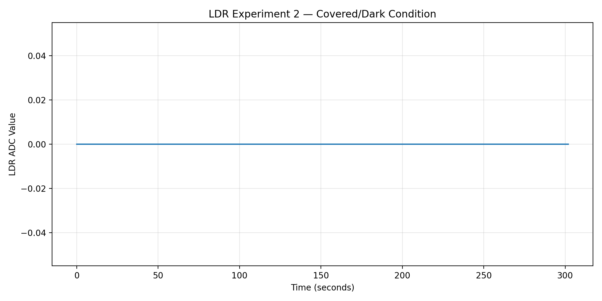

#### Engineering Interpretation

The experiment demonstrated a clear response of the LDR circuit to the covered/dark condition.

Under normal room lighting, the ADC values were in the thousands, while under the covered/dark condition the measured ADC value was **0**.

This provides a useful baseline for detecting very low-light conditions in the Smart Agriculture Monitoring and Irrigation System.

The experiment characterizes the ADC response of the particular LDR module and ESP32 setup. 

It does not establish an absolute light-intensity measurement in lux because no calibrated light meter was used.

---


### Experiment 3 — Bright Light Condition

#### Objective

The third experiment investigated the response of the LDR sensor under a bright-light condition.

The purpose was to determine how the ESP32 ADC value changes when the photoresistor is exposed to a high level of illumination and to evaluate the stability of the sensor readings under this condition.

The LDR was tested independently using the ESP32 before integrating it with the complete Smart Agriculture Monitoring and Irrigation System.

#### Experimental Procedure

For this experiment, the LDR sensor was exposed to a bright light source.

The ESP32 continuously measured the analog output of the LDR using its ADC input.

The experiment consisted of approximately **302 ADC readings** collected at a sampling interval of approximately **1 second**.

The ADC values were recorded in the following CSV file:

`data/ldr/experiment3_bright_light.csv`

#### Experimental Condition

| Parameter | Condition |
|---|---|
| Experiment | Experiment 3 |
| Light condition | Bright light |
| Sensor | Photoresistor (LDR) |
| Microcontroller | ESP32 |
| ADC pin | GPIO 34 |
| Number of readings | 302 |
| Sampling interval | Approximately 1 second |
| ADC resolution | 12-bit |
| ADC range | 0–4095 |

#### Statistical Analysis

The collected ADC measurements were analyzed using the minimum, maximum, and range.

| Statistic | ADC Value |
|---|---:|
| Number of readings | 302 |
| Minimum | 3975 |
| Maximum | 4095 |
| Range | 120 |

The readings were concentrated close to the upper end of the ESP32 ADC range. Many measurements were above 4000, and several readings reached the maximum ADC value of **4095**.

#### Observations

The LDR produced very high ADC values when exposed to bright light.

The majority of the measurements were approximately between **4000 and 4095**, indicating that the sensor output was close to the upper limit of the ESP32 ADC range.

Several readings reached **4095**, which is the maximum value that can be represented by the 12-bit ADC.

The minimum recorded value was **3975**, while the maximum was **4095**, giving an observed range of **120 ADC units**.

Compared with the covered/dark experiment, where the ADC values were close to zero, the bright-light experiment produced a substantially higher ADC response.

#### Engineering Interpretation

The experiment demonstrates that the LDR module produces a strong ADC response when exposed to bright light.

The large difference between the dark-condition measurements and the bright-light measurements makes the sensor suitable for detecting significant changes in illumination.

However, the readings in bright light are close to the maximum ADC value of 4095. This indicates that the sensor output is approaching ADC saturation under strong illumination.

This is important for the final Smart Agriculture Monitoring and Irrigation System because the LDR can be used to distinguish between dark, normal-light, and bright-light conditions. However, additional calibration experiments would be required if accurate light-intensity measurement rather than simple light-level classification is needed.

#### ADC vs. Time

The ADC values were plotted against the measurement sequence to visualize the LDR response during the bright-light experiment.

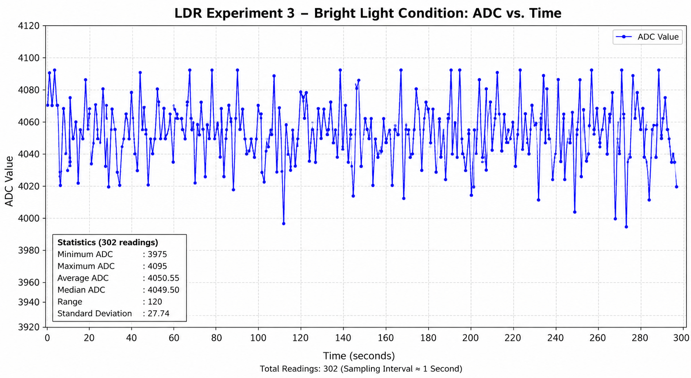

The graph shows that the ADC readings remain at a high level throughout the experiment, with relatively small fluctuations compared with the overall ADC value.

#### Conclusion

The bright-light experiment confirmed that the LDR sensor responds strongly to increased illumination.

The ESP32 ADC readings remained close to the upper ADC limit, with values ranging from **3975 to 4095** across the 302 collected measurements.

Together with the dark-condition experiment, these results demonstrate that the LDR can provide a clear electrical response to different lighting conditions.

The results can therefore be used as a basis for developing a light-level threshold for the Smart Agriculture Monitoring and Irrigation System.


## LDR Data

The experimental datasets are stored in the following directory:

```text
data/
└── ldr/
    ├── experiment1_stable.csv
    └── experiment2_dark.csv
    └── experiment3_bright.csv
```
---

### Light-Level Threshold Determination

The results from the three LDR experiments were compared to determine initial ADC-based light-level thresholds.

The measured ranges were:

| Light Condition | Minimum ADC | Maximum ADC |
|---|---:|---:|
| Covered / Dark | 0 | 53 |
| Normal Room Light | 3515 | 3747 |
| Bright Light | 3975 | 4095 |

The measurements showed clear separation between the tested lighting conditions.

Based on these experimental results, the following initial thresholds were defined:

| Light Level | ADC Range | Interpretation |
|---|---:|---|
| Dark | 0–100 | Very little light |
| Normal | 101–3900 | Normal/intermediate light |
| Bright | 3901–4095 | Strong light |

These thresholds were selected with margins around the experimentally observed values. The dark threshold of 100 ADC is above the maximum dark-condition measurement of 53 ADC. The bright threshold of 3901 ADC is below the minimum bright-light measurement of 3975 ADC and above the maximum normal-room-light measurement of 3747 ADC.

The thresholds are specific to the current LDR module, ESP32 ADC configuration, sensor orientation, and tested environmental conditions. They should therefore be considered initial engineering thresholds rather than universal light-intensity values.

The ADC readings are not directly converted to lux because no calibrated light meter was used during the experiments.

#### Initial Light Classification

The current classification logic can be represented as:

```text
ADC Value
    |
    ├── 0–100
    │     └── DARK
    |
    ├── 101–3900
    │     └── NORMAL
    |
    └── 3901–4095
          └── BRIGHT
```

---


### LDR Threshold Validation

#### Objective

The threshold validation experiment was performed to determine whether the ADC ranges identified during the previous LDR experiments could be used to classify different lighting conditions.

Additional lighting conditions were tested using the same ESP32 and LDR circuit. The measured ADC values were compared with the results from the previous experiments to validate suitable empirical thresholds for the Smart Agriculture Monitoring and Irrigation System.

The thresholds are specific to the tested ESP32, LDR circuit, and experimental setup. They should therefore be considered empirical thresholds rather than universal light-intensity limits.

#### Experimental Conditions

Five lighting conditions were evaluated:

| Condition | Description |
| --------- | ----------- |
| Dark | LDR covered / very little light |
| Dim Light | Low-level room lighting |
| Normal Room Light | Normal indoor room lighting |
| Direct Flashlight | Direct light from a flashlight |
| Indirect Daylight | Daylight near a window without directly illuminating the sensor |

#### Statistical Results

The following table summarizes the ADC measurements collected during the threshold validation experiments:

| Condition | Number of Readings | Minimum ADC | Maximum ADC | Average ADC | Range |
| --------- | -----------------: | ----------: | ----------: | ----------: | ----: |
| Dark | 32 | 0 | 53 | ~18 | 53 |
| Dim Light | 100 | 537 | 737 | 645.43 | 200 |
| Normal Room Light | 100 | 2928 | 3050 | 2985.64 | 122 |
| Direct Flashlight | 101 | 3887 | 4057 | 3981.78 | 170 |
| Indirect Daylight | 100 | 4053 | 4095 | 4093.04 | 42 |

#### Observations

The LDR ADC value increased as the amount of incident light increased.

The dark condition produced very low ADC values, ranging from approximately 0 to 53.

Under dim lighting, the ADC values increased to 537–737, providing clear separation from the dark condition.

Under normal room lighting, the ADC values ranged from 2928 to 3050.

Direct flashlight illumination produced higher ADC values, ranging from 3887 to 4057.

The additional indirect-daylight condition produced very high ADC values, ranging from 4053 to 4095. This confirmed that the additional lighting condition was also classified as bright.

There was no overlap between the measured ADC ranges of the tested dark, dim, normal, and bright conditions.

#### Indirect Daylight Validation

The additional indirect-daylight condition was used to validate the previously proposed bright-light threshold.

The 100 collected readings produced the following results:

| Parameter | Result |
| --------- | ------: |
| Number of readings | 100 |
| Minimum ADC | 4053 |
| Maximum ADC | 4095 |
| Average ADC | 4093.04 |
| Range | 42 |

All 100 readings were above the proposed bright-light threshold of 3501.

Therefore:

```text
100 / 100 readings → Bright
```

---

### LDR Classification Integration

#### Objective

After experimentally determining and validating the LDR ADC thresholds, the light-level classification was integrated into the ESP32 firmware.

Instead of reporting only the raw ADC value, the ESP32 now converts the measured ADC value into a light-level category.

The classification uses the empirically determined thresholds:

| ADC Range | Light Classification |
| --------- | -------------------- |
| 0–100 | Dark |
| 101–1000 | Dim |
| 1001–3500 | Normal |
| 3501–4095 | Bright |

#### Classification Logic

The ESP32 reads the LDR through ADC GPIO 34 and classifies the measured value according to the experimentally validated thresholds.

```cpp
if (ldrValue <= 100)
{
    lightLevel = "DARK";
}
else if (ldrValue <= 1000)
{
    lightLevel = "DIM";
}
else if (ldrValue <= 3500)
{
    lightLevel = "NORMAL";
}
else
{
    lightLevel = "BRIGHT";
}
```


### LDR Classification Integration Test

The LDR classification logic was integrated into the ESP32 system to convert raw ADC measurements into four light-level categories:

- `DARK`
- `DIM`
- `NORMAL`
- `BRIGHT`

The classification logic was tested under four different lighting conditions.

#### Classification Results

| Lighting Condition | Minimum ADC | Maximum ADC | ADC Range | Classification | Correct |
|---|---:|---:|---:|---|---:|
| DARK | 0 | 42 | 42 | DARK | 14/14 |
| DIM | 257 | 384 | 127 | DIM | 14/14 |
| NORMAL | 2768 | 2863 | 95 | NORMAL | 14/14 |
| BRIGHT | 3825 | 3982 | 157 | BRIGHT | 14/14 |

#### Overall Classification Performance

A total of 56 readings were collected during the integration tests.

| Metric | Result |
|---|---:|
| Total readings | 56 |
| Correct classifications | 56 |
| Incorrect classifications | 0 |
| Classification consistency | 100% |

#### Observation

The LDR classification logic correctly classified all tested readings into their corresponding lighting categories.

The DARK condition produced very low ADC values, while the DIM condition produced higher values. Normal room light produced substantially higher ADC values, and the BRIGHT condition produced values close to the upper limit of the ESP32 ADC range.

The results demonstrate that the current LDR classification logic provides consistent classification under the tested lighting conditions.

This result represents classification consistency for the tested experimental conditions and does not establish absolute light-intensity accuracy or guarantee performance under all possible lighting environments.

---

### Gradual Lighting Transition Validation

A gradual lighting transition experiment was performed to determine whether the LDR classification remains stable when the illumination level changes progressively.

The light level was gradually increased from a dark condition through dim and normal room lighting to a bright condition.

The classification categories were:

```text
DARK → DIM → NORMAL → BRIGHT
```

Two transition experiments were performed:

1.Increasing illumination: DARK → DIM → NORMAL → BRIGHT

2.Decreasing illumination: BRIGHT → NORMAL → DIM → DARK


The purpose was to verify that the classifier changes categories in the expected order without unexpected classification changes or oscillation.

---

### Experiment A — Increasing Light

The first experiment started with the LDR completely covered and the illumination was gradually increased.

The expected classification sequence was:

DARK → DIM → NORMAL → BRIGHT

A total of 89 readings were collected.

#### Results
| Classification | Readings | Minimum ADC | Maximum ADC | ADC Range |   Correct |
| -------------- | -------: | ----------: | ----------: | --------: | --------: |
| DARK           |       19 |           0 |          85 |        85 |     19/19 |
| DIM            |       19 |         123 |         823 |       700 |     19/19 |
| NORMAL         |       35 |        1100 |        3408 |      2308 |     35/35 |
| BRIGHT         |       16 |        3571 |        3621 |        50 |     16/16 |
| **Total**      |   **89** |       **0** |    **3621** |         — | **89/89** |

#### Observed Transition Regions

| Transition      | Previous Category | Next Category | Observed Transition Region |
| --------------- | ----------------: | ------------: | -------------------------: |
| DARK → DIM      |            85 ADC |       123 ADC |                 85–123 ADC |
| DIM → NORMAL    |           823 ADC |      1100 ADC |               823–1100 ADC |
| NORMAL → BRIGHT |          3408 ADC |      3571 ADC |              3408–3571 ADC |

These values represent the observed transition regions during the experiment. They should not be interpreted as exact threshold boundaries because intermediate ADC values were not sampled continuously.

#### Increasing-Light Stability

The classifier followed the expected sequence:

DARK → DIM → NORMAL → BRIGHT

No classification oscillation was observed during the gradual increase in illumination.

Classification consistency:

**89/89 = 100%**

There were no observed incorrect classifications.

---

### Experiment B — Decreasing Light

The second experiment tested the reverse transition. The illumination was gradually decreased from a bright condition.

The expected classification sequence was:

```text
BRIGHT → NORMAL → DIM → DARK
```

A total of 101 readings were collected.

#### Results
| Classification | Readings | Minimum ADC | Maximum ADC | ADC Range |     Correct |
| -------------- | -------: | ----------: | ----------: | --------: | ----------: |
| BRIGHT         |       21 |        3555 |        3863 |       308 |       21/21 |
| NORMAL         |       27 |        1073 |        3474 |      2401 |       27/27 |
| DIM            |       38 |         111 |         976 |       865 |       38/38 |
| DARK           |       15 |           0 |          84 |        84 |       15/15 |
| **Total**      |  **101** |       **0** |    **3863** |         — | **101/101** |

#### Observed Transition Regions

| Transition      | Previous Category | Next Category | Observed Transition Region |
| --------------- | ----------------: | ------------: | -------------------------: |
| BRIGHT → NORMAL |          3555 ADC |      3474 ADC |              3474–3555 ADC |
| NORMAL → DIM    |          1073 ADC |       976 ADC |               976–1073 ADC |
| DIM → DARK      |           111 ADC |        75 ADC |                 75–111 ADC |

These values represent the observed transition regions during the experiment. They should not be interpreted as exact threshold boundaries because intermediate ADC values were not sampled continuously.

#### Decreasing-Light Stability

The classifier followed the expected sequence:

BRIGHT → NORMAL → DIM → DARK

No classification oscillation was observed during the gradual decrease in illumination.

Classification consistency:

**101/101 = 100%**

There were no observed incorrect classifications.


#### Combined Gradual Transition Validation

Both increasing-light and decreasing-light experiments were completed to test the stability of the LDR classification system in both directions.

| Test Direction   | Classification Sequence      | Readings |     Correct | Consistency |
| ---------------- | ---------------------------- | -------: | ----------: | ----------: |
| Increasing light | DARK → DIM → NORMAL → BRIGHT |       89 |       89/89 |        100% |
| Decreasing light | BRIGHT → NORMAL → DIM → DARK |      101 |     101/101 |        100% |
| **Combined**     | —                            |  **190** | **190/190** |    **100%** |

Across both experiments, a total of **190** readings were analyzed.

All 190 readings were classified consistently, with no observed classification oscillation.


#### Engineering Interpretation

The gradual lighting transition experiments demonstrated that the LDR classification system remained stable while the illumination level was changed gradually in both directions.

During increasing illumination, the classifier progressed through:

DARK → DIM → NORMAL → BRIGHT

During decreasing illumination, the classifier progressed through:

BRIGHT → NORMAL → DIM → DARK

No unexpected category changes or classification oscillations were observed in either experiment.

The results provide evidence that the current LDR classification logic behaves consistently under the tested gradual lighting conditions.

The observed transition regions can also be used to understand the behavior of the classification thresholds. However, these transition regions should not be considered exact threshold boundaries because the ADC values between the observed transition points were not sampled continuously.

The results are specific to the experimental conditions used during testing and do not establish universal threshold validity for all possible lighting environments.

---

### Gradual Lighting Transition Validation Status
- [x] Test increasing illumination
- [x] Test decreasing illumination
- [x] Record ADC values and classifications
- [x] Determine observed transition regions
- [x] Check for classification oscillation
- [x] Validate classification stability
- [x] Compare increasing and decreasing transitions
- [x] Confirm 100% consistency for the tested readings

Result: The LDR classification system achieved 100% classification consistency across 190 tested readings during gradual lighting transitions.


### LDR Characterization Status

- [x] Understand LDR/photoresistor operation
- [x] Connect LDR to ESP32
- [x] Test stable room-light condition
- [x] Test covered/dark condition
- [x] Test bright-light condition
- [x] Collect ADC measurements
- [x] Analyze minimum and maximum ADC values
- [x] Generate ADC vs. Time graphs
- [x] Determine light-level thresholds
- [x] Validate thresholds under additional lighting conditions
- [x] Validate classification during gradual lighting transitions
- [x] Integrate LDR with the complete system   


## 3. Water Level Sensor

### Objective

The water level sensor was investigated to understand its analog output and how the ADC value changes according to the presence and level of water.

The sensor was tested independently using an ESP32 before integrating it with the complete Smart Agriculture Monitoring and Irrigation System.

### Hardware

* **Microcontroller:** ESP32
* **Sensor:** Water Level Sensor
* **Output:** Analog
* **ADC resolution:** 12-bit
* **ADC range:** 0–4095
* **Water Level Sensor signal pin:** GPIO 33

### Water Level Sensor Wiring

The water level sensor was connected to the ESP32 as follows:

| Sensor Pin | ESP32 |
| ---------- | ----- |
| VCC        | 3.3V  |
| GND        | GND   |
| SIG        | GPIO 33 |

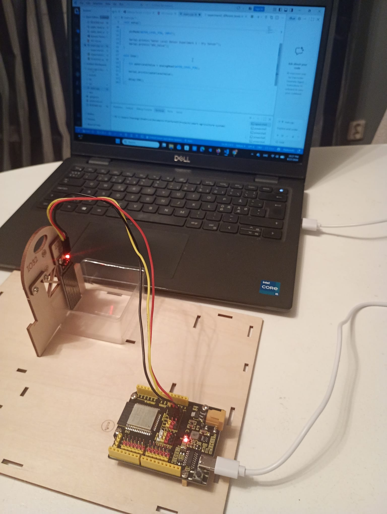

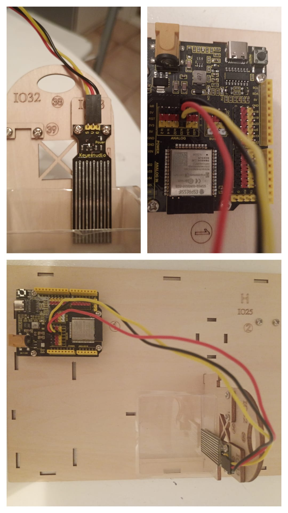

### Software

The water level sensor was programmed using PlatformIO and the Arduino framework.

No additional sensor library was required because the sensor provides an analog output that can be read directly using the ESP32 ADC.

The sensor was configured as:

```cpp
#define WATER_LEVEL_PIN 33
```
The ESP32 reads the analog output from the water level sensor using analogRead().

The ADC value is used as an indicator of the amount of water detected by the sensing area.

### Data Format

The sensor output was recorded in CSV-compatible format to simplify data collection and later analysis:

```text
ADC_Value
0
0
0
0
0
```

### Serial Monitor Output

The water level sensor measurements were observed through the PlatformIO Serial Monitor.

## Water Level Sensor Experiments

Six experiments are planned to characterize the behavior of the water level sensor and develop a reliable water-level classification method.

### Water Level Sensor Experiment 1 — Empty / No-Water Condition

#### Objective

The first water level sensor experiment investigated the basic behavior and stability of the ESP32 ADC readings when the sensor was in an empty, no-water condition.

The sensor was tested independently using the ESP32 before integrating it with the complete Smart Agriculture Monitoring and Irrigation System.

#### Experimental Procedure

The water level sensor was connected to the ESP32 and kept completely dry with no water present on the sensing surface. The ADC value was recorded continuously for approximately 5 minutes.

The experiment produced 300 ADC measurements.

The complete dataset is stored in:

`data/water_level/experiment1_empty.csv`

#### Statistical Results

| Parameter | Result |
|---|---:|
| Number of readings | 300 |
| Minimum ADC value | 0 |
| Maximum ADC value | 0 |
| Average ADC value | 0.00 |
| Median ADC value | 0 |
| ADC range | 0 |
| Standard deviation | 0.00 |
| Coefficient of variation | 0.00% |
| First reading | 0 |
| Last reading | 0 |
| Change, first → last | 0 ADC |
| Percentage change | 0.00% |

#### Observations

During the empty/no-water experiment, the water level sensor produced ADC values between **0 and 0**, with an average ADC value of **0.00**.

All 300 measurements were identical. Therefore, no variation was observed in the ADC output during the experiment.

The first reading was **0** and the final reading was **0**, corresponding to a change of **0 ADC counts**, or **0.00%**.

#### Engineering Interpretation

The experiment demonstrates that the water level sensor and ESP32 ADC produced a completely stable output when no water was present under the tested conditions.

The observed ADC value of **0** provides a baseline for the empty/no-water condition.

However, this result should not yet be used as the final `EMPTY` classification threshold. Additional measurements at different water levels are required to determine how the ADC output changes as the sensing area becomes covered by water.

The results from this experiment will be used as a baseline for comparison with measurements obtained at low, medium, high, and full water levels.

#### Graph

The ADC readings were plotted against measurement time to visualize the stability of the water level sensor output.

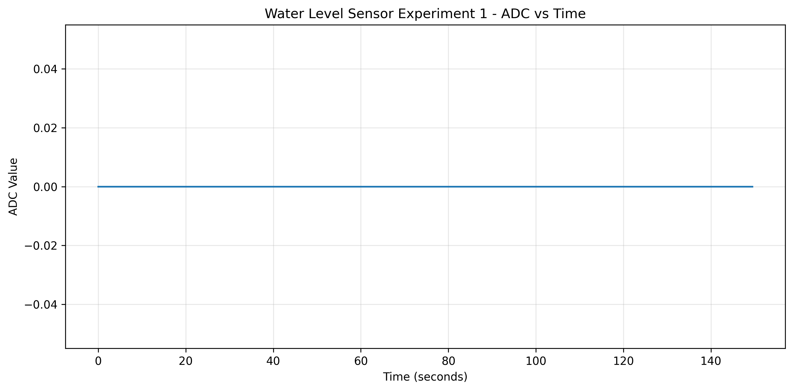

### Experiment 2 — Different Water Levels

#### Objective

The second water level sensor experiment investigated how the ESP32 ADC reading changes as the amount of water covering the sensing area increases.

Five water-level conditions were considered:

- **EMPTY / No Water**
- **LOW**
- **MEDIUM**
- **HIGH**
- **FULL**

The purpose of this experiment was to identify the ADC range associated with each water-level condition and determine whether the sensor output provides sufficient separation between the different levels.

#### Experimental Procedure

The water level sensor was connected to GPIO 33 of the ESP32.

Measurements were collected for different water-level conditions by gradually increasing the amount of water covering the sensing area.

The following conditions were tested:

1. **EMPTY / No Water**
2. **LOW**
3. **MEDIUM**
4. **HIGH**
5. **FULL**

For each condition, multiple ADC measurements were collected using the ESP32 ADC.

The collected measurements are stored in:

`data/water_level/experiment2_different_levels.csv`

#### Statistical Results

| Parameter | EMPTY / No Water | LOW | MEDIUM | HIGH | FULL |
|---|---:|---:|---:|---:|---:|
| Number of readings | 300 | 320 | 320 | 320 | 320 |
| Minimum ADC value | 0 | 643 | 1793 | 2000 | 2061 |
| Maximum ADC value | 0 | 1217 | 2005 | 2106 | 2176 |
| Average ADC value | 0.00 | 897.65 | 1892.16 | 2069.55 | 2111.45 |
| Median ADC value | 0 | 885.50 | 1889.00 | 2072.00 | 2112.00 |
| ADC range | 0 | 574 | 212 | 106 | 115 |
| Standard deviation | 0.00 | 110.15 | 57.59 | 31.03 | 22.89 |
| Coefficient of variation | 0.00% | 12.27% | 3.04% | 1.50% | 1.08% |
| First reading | 0 | 874 | 1998 | 2081 | 2118 |
| Last reading | 0 | 778 | 1811 | 2060 | 2111 |
| Change, first → last | 0 | -96 | -187 | -21 | -7 |
| Percentage change | 0.00% | -10.98% | -9.36% | -1.01% | -0.33% |

#### Observations

The ADC output increased as the water level increased.

Under the **EMPTY / No Water** condition, the sensor produced an ADC value of **0** throughout the measurements.

For the **LOW** water-level condition, the ADC values ranged from **643 to 1217**, with an average value of **897.65**.

For the **MEDIUM** water-level condition, the ADC values ranged from **1793 to 2005**, with an average value of **1892.16**.

For the **HIGH** water-level condition, the ADC values ranged from **2000 to 2106**, with an average value of **2069.55**.

For the **FULL** condition, the ADC values ranged from **2061 to 2176**, with an average value of **2111.45**.

The results show a clear separation between the **EMPTY**, **LOW**, and **MEDIUM** conditions. However, there is some overlap between the ADC ranges of the **MEDIUM**, **HIGH**, and **FULL** conditions.

The LOW condition also showed greater variation than the higher water-level conditions, with a standard deviation of **110.15 ADC counts** and a coefficient of variation of **12.27%**.

#### Engineering Interpretation

The experiment demonstrates that the water level sensor produces an increasing ADC response as the water level increases.

The large difference between the EMPTY condition and the other water levels indicates that the sensor can clearly detect the presence of water in the tested setup.

The results also suggest that the sensor can distinguish between LOW and MEDIUM water levels relatively well. However, the ADC ranges of MEDIUM, HIGH, and FULL overlap, meaning that final classification thresholds should not be selected based only on this experiment.

Further experiments are therefore required to evaluate sensor stability and determine reliable thresholds.

The results from this experiment will be used as the basis for:

- **Experiment 3 — Stability**
- **Experiment 4 — Threshold Determination**
- **Experiment 5 — Changing Water Level**

#### Graph

The ADC measurements were compared across the different water-level conditions to visualize how the sensor output changes with increasing water level.

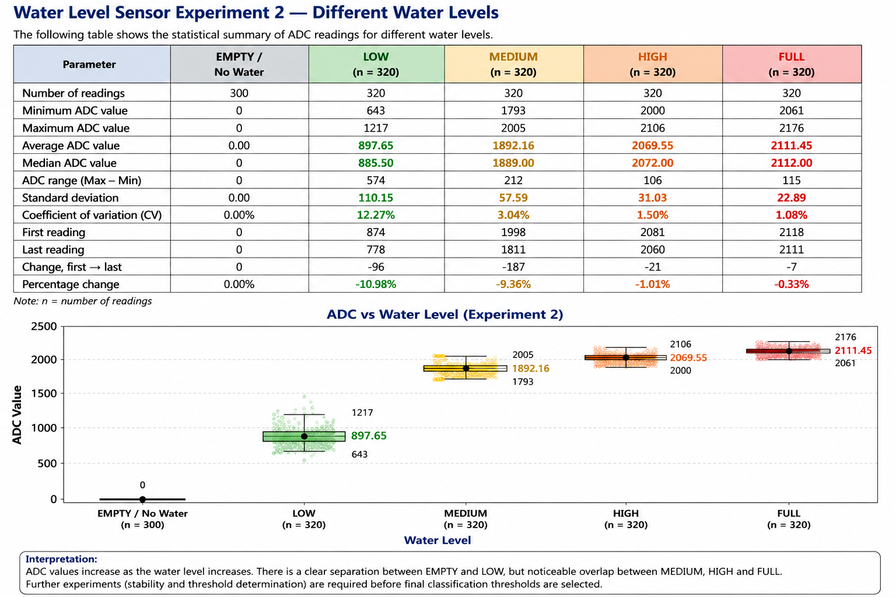


### Experiment 3 — Stable Medium Water Level

#### Objective

The third water-level experiment investigated the short-term stability of the water-level sensor when the sensor was maintained at a fixed medium water level.

#### Experimental Procedure

The water-level sensor was placed at a fixed medium water level and kept undisturbed while ADC measurements were collected.

A total of **300 ADC measurements** were recorded at approximately 1-second intervals.

The complete dataset is stored in:

`data/water_level/experiment3_stable.csv`

#### Statistical Results

| Parameter | Result |
|---|---:|
| Number of readings | 300 |
| Minimum ADC value | 1535 |
| Maximum ADC value | 1636 |
| Average ADC value | 1595.77 |
| Median ADC value | 1596 |
| ADC range | 101 |
| Standard deviation | 7.79 |
| Coefficient of variation | 0.49% |

#### Observations

During the stable medium-water-level experiment, the water-level sensor produced ADC values between **1535 and 1636**, with an average ADC value of **1595.77**.

The median ADC value was **1596**, which is very close to the average value. This indicates that the readings were concentrated around approximately 1596 ADC counts.

The total ADC range was **101 counts**. The standard deviation was **7.79 ADC counts**, while the coefficient of variation was only **0.49%**.

The relatively low coefficient of variation indicates that the sensor produced a highly stable ADC output while the water level remained constant.

#### Engineering Interpretation

The experiment demonstrates that the water-level sensor and ESP32 ADC can provide stable measurements when the sensor position and water level remain unchanged.

The stability observed in this experiment is important for the later water-level classification stage. A stable ADC value at a fixed water level reduces the possibility of unnecessary changes between water-level categories caused by small measurement fluctuations.

However, this experiment only evaluates stability at the tested medium water level. It does not establish the final thresholds for EMPTY, LOW, MEDIUM, HIGH, and FULL conditions. Those thresholds will be determined and validated in the following experiments.

#### Graph

The ADC readings were plotted against measurement time to visualize the stability of the water-level sensor output.

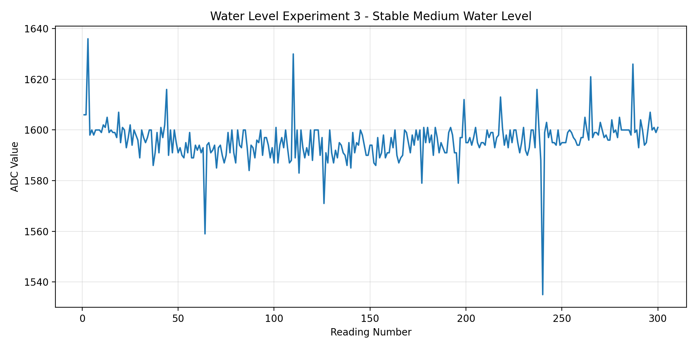


### Experiment 4 — Threshold Determination & Boundary Validation

#### Objective

The fourth experiment was conducted to determine suitable ADC thresholds for classifying the water level into five categories:

- EMPTY
- LOW
- MEDIUM
- HIGH
- FULL

The thresholds were first investigated using measurements collected at different water levels. Boundary validation was then performed by gradually adding and removing water to determine whether the classification changed correctly and remained stable.

#### Threshold Classification

The current classification uses the following approximate ADC regions:

| Water Level | ADC Range / Classification |
|---|---:|
| EMPTY | Lowest ADC region |
| LOW | Low ADC region |
| MEDIUM | Intermediate ADC region |
| HIGH | High ADC region |
| FULL | Highest ADC region |

The exact thresholds were evaluated using the experimental measurements rather than assuming that the ADC scale directly represents a physical water-volume measurement.

---

### Gradual Water Addition

#### Objective

A gradual water-filling test was performed to determine whether the water-level classification changed correctly as the water level was progressively increased.

The experiment was used to verify the transition between the five water-level categories:

EMPTY → LOW → MEDIUM → HIGH → FULL

#### Procedure

The container was initially empty and the water-level sensor was positioned at the measurement location.

Water was then gradually added while ADC measurements were continuously recorded.

A total of **38** ADC readings were collected during the gradual water-filling sequence.

The complete dataset is stored in:

`data/water_level/experiment4_gradual_filling.csv`

#### Statistical Summary

| Water Level | Number of Readings | Minimum ADC | Maximum ADC | Average ADC |
| ----------- | -----------------: | ----------: | ----------: | ----------: |
| EMPTY       |                  6 |         421 |         489 |      453.17 |
| LOW         |                  4 |         511 |        1250 |      760.75 |
| MEDIUM      |                  7 |        1630 |        1982 |     1872.14 |
| HIGH        |                  7 |        2014 |        2076 |     2053.86 |
| FULL        |                 14 |        2095 |        2128 |     2110.79 |
| **Total**   |             **38** |     **421** |    **2128** |           — |

#### Observed Transition Points

During gradual water filling, the classification changed in the following order:

**EMPTY → LOW → MEDIUM → HIGH → FULL**

The observed transition regions were approximately:

- EMPTY → LOW: around 489–511 ADC
- LOW → MEDIUM: around 1250–1630 ADC
- MEDIUM → HIGH: around 1982–2014 ADC
- HIGH → FULL: around 2076–2095 ADC

These transitions demonstrate that the classifier responds progressively as the water level increases.

#### Classification Errors

No obvious classification errors were observed during the actual gradual water-filling sequence.

The readings followed the expected increasing sequence:

**EMPTY → LOW → MEDIUM → HIGH → FULL**

One additional reading of 2043 ADC, classified as HIGH, was recorded after the FULL readings. However, this reading was caused by accidentally lifting the sensor out of its previous position during the experiment. Therefore, it was treated as a physical disturbance rather than a classification error and was not considered part of the gradual filling sequence.

#### Classification Stability

The classification remained stable during the gradual water-filling process.

The observed sequence was:

**EMPTY → LOW → MEDIUM → HIGH → FULL**

No unexpected reversals such as:

`LOW → EMPTY`

or

`MEDIUM → LOW`

were observed during the controlled water addition.

This indicates that the classification system responds consistently when the water level is gradually increased.

#### Threshold Decision

The gradual water-filling experiment provides good initial validation of the current threshold ranges.

The observed category boundaries were clearly separated:

- EMPTY readings ended at 489 ADC
- LOW readings started at 511 ADC
- MEDIUM readings started at 1630 ADC
- HIGH readings started at 2014 ADC
- FULL readings started at 2095 ADC

The filling experiment alone does not indicate that the thresholds need to be changed.

However, the HIGH → FULL boundary should be considered carefully because the observed values are relatively close: 2076 ADC (HIGH) and 2095 ADC (FULL).

Therefore, the filling results should be evaluated together with the gradual water-removal experiment and boundary-validation data before permanently finalizing the thresholds.


#### Graph — Gradual Water Adding

The ADC measurements were plotted against measurement number to visualize how the sensor output changed as water was gradually added.

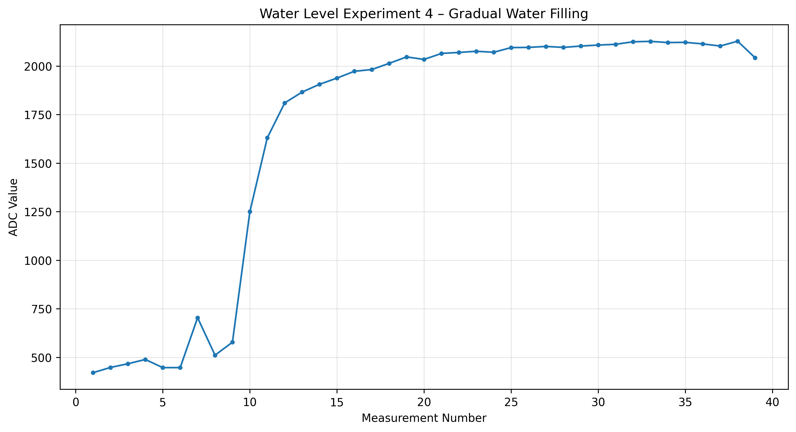

#### Engineering Interpretation

The gradual water-filling experiment demonstrated that the selected ADC thresholds can distinguish the five tested water-level categories.

The classification changed in the expected direction as water was added:

EMPTY → LOW → MEDIUM → HIGH → FULL

No obvious incorrect classification was observed during the gradual filling process.

---

### Gradual Water Removal

#### Objective

A gradual water-removal test was performed to determine whether the classification remained stable when the water level was progressively decreased.

#### Procedure

The container was initially filled and the sensor was positioned at the measurement location.

Water was then gradually removed while ADC measurements were continuously recorded.

A total of **74 ADC readings** were collected.

The complete dataset is stored in:

`data/water_level/experiment4_gradual_removal.csv`

#### Statistical Summary

| Water Level | Number of Readings | Minimum ADC | Maximum ADC | Average ADC |
|---|---:|---:|---:|---:|
| FULL | 33 | 2079 | 2219 | 2168.18 |
| HIGH | 3 | 2042 | 2079 | 2061.67 |
| MEDIUM | 12 | 1504 | 1999 | 1819.92 |
| LOW | 12 | 771 | 1471 | 1152.25 |
| EMPTY | 14 | 0 | 475 | 103.50 |
| **Total** | **74** | **0** | **2219** | — |

#### Observed Transition Points

During gradual water removal, the classification changed in the following order:

**FULL → HIGH → MEDIUM → LOW → EMPTY**

The observed transition regions were approximately:

- FULL → HIGH: around 2079 ADC
- HIGH → MEDIUM: around 2042 ADC
- MEDIUM → LOW: around 1471–1504 ADC
- LOW → EMPTY: around 454–475 ADC

These transitions demonstrate that the classifier responds progressively to decreasing water level.

#### Classification Errors

No obvious classification errors were observed during the gradual water-removal experiment.

The readings followed the expected decreasing sequence without unexpected transitions to higher water-level categories.

For example, no transitions such as:

`LOW → HIGH`

or

`MEDIUM → FULL`

were observed.

#### Classification Stability

The classification remained stable during gradual water removal.

The observed sequence was:

**FULL → HIGH → MEDIUM → LOW → EMPTY**

This indicates that the current classification approach responds correctly when the water level decreases gradually.

#### Threshold Decision

Based on the gradual addition and removal experiments, the current thresholds do not need to be changed at this stage.

The experiments demonstrate that the thresholds provide a practical separation between the five tested water-level categories.

Further testing can still be performed under different container conditions, sensor positions, and repeated water-level changes before considering the thresholds permanently finalized.

#### Graph — Gradual Water Removal

The ADC measurements were plotted against measurement number to visualize how the sensor output changed as water was gradually removed.

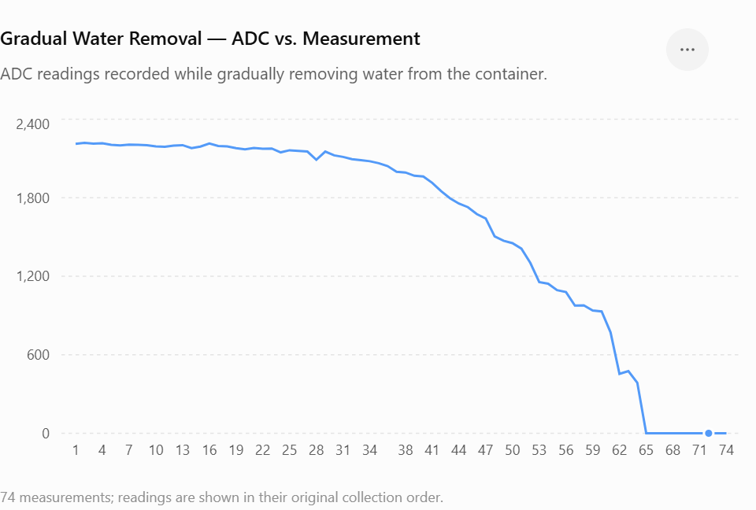

#### Engineering Interpretation

The gradual water-removal experiment provides important validation of the water-level classification system.

The ADC value decreased as the water level was reduced, and the classification changed in the expected order from FULL to EMPTY.

The absence of obvious classification reversals indicates that the thresholds are suitable for the current experimental setup.

---