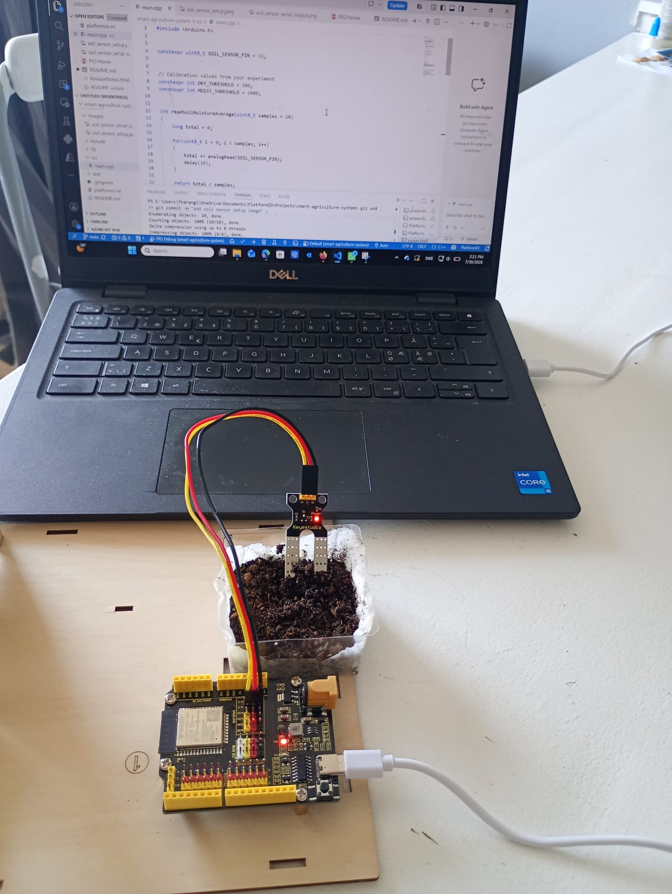
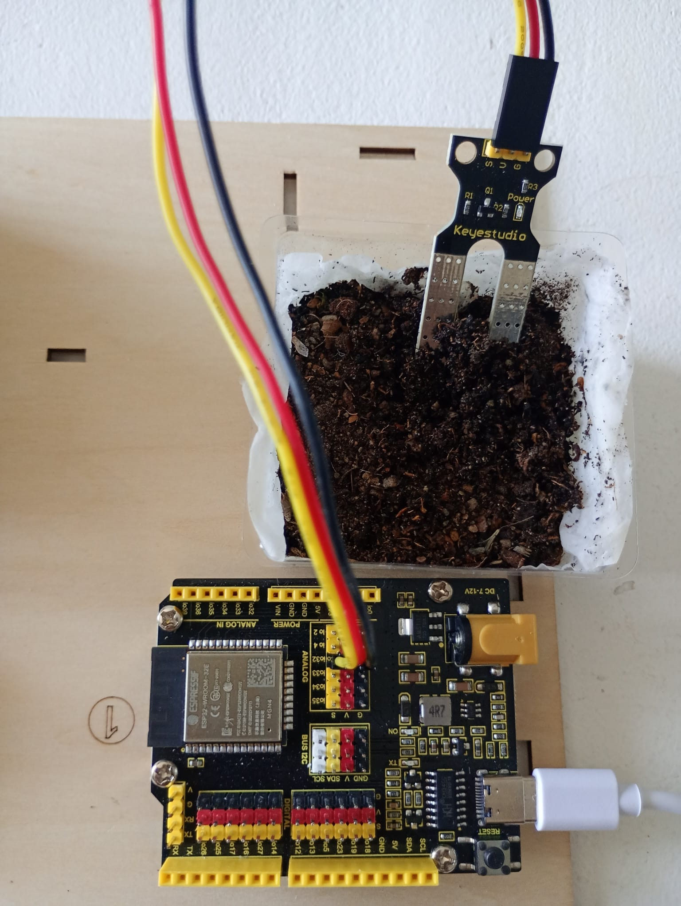
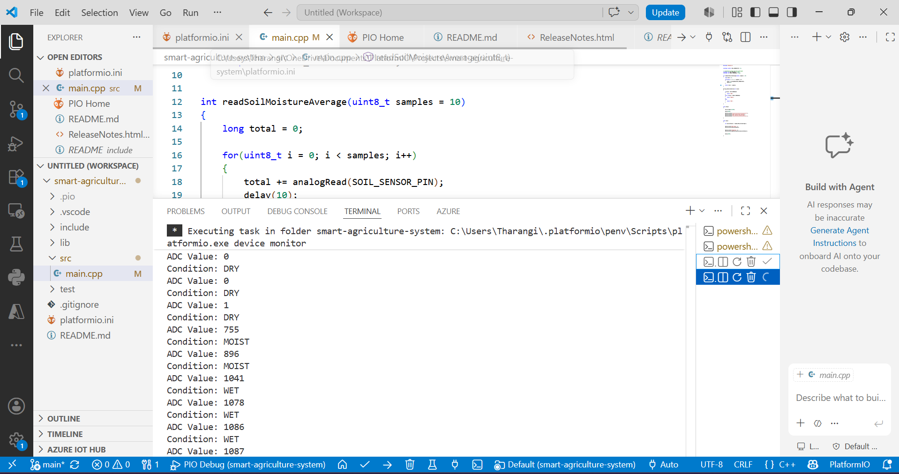
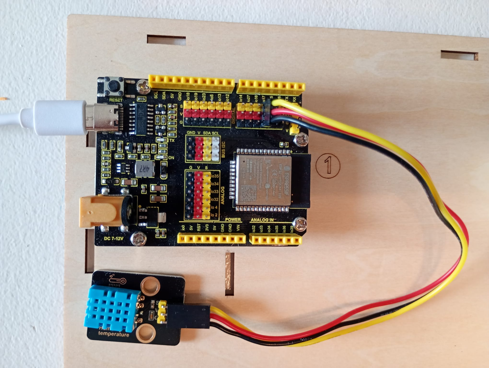

# Smart Agriculture Monitoring and Irrigation System 🌱

## Soil Moisture Sensor Investigation

This is the first phase of the Smart Agriculture Monitoring and Irrigation System.

The objective is to understand sensor behaviour, collect measurements, perform calibration, and prepare the sensor for future IoT integration.

## Hardware

- ESP32 Development Board
- Soil Moisture Sensor
- Breadboard
- Jumper Wires
- USB Cable

## Hardware Setup



## Wiring Diagram



## Serial Monitor Output




## Sensor Working Principle

The soil moisture sensor measures changes in electrical conductivity caused by water content in soil.

The sensor output is converted into an ADC value by the ESP32.


## Calibration Experiment

The sensor was tested under different soil conditions.

| Condition | ADC Value Range |
|---|---|
| Dry soil | 0-200 |
| Moist soil | 200-1000 |
| Wet soil | Above 1000 |


## Observations

- ADC values increased when soil moisture increased.
- Multiple readings were averaged to reduce sensor noise.
- Calibration values were obtained experimentally.


## Software

- Visual Studio Code
- PlatformIO
- Arduino Framework
- C++


## Current Status

Completed:
- Sensor connection
- Data collection
- Calibration
- ESP32 implementation


## Future Work

- Add temperature and humidity monitoring
- Add water level monitoring
- Control irrigation pump automatically
- Send data through WiFi
- Store data in database
- Apply machine learning for irrigation prediction


## 2. DHT11 Temperature and Humidity Sensor

### Objective

The DHT11 sensor was investigated to understand its temperature and relative humidity measurements, short-term stability, response to environmental changes, and recovery behavior.

The sensor was tested independently using an ESP32 before integrating it with the complete Smart Agriculture Monitoring and Irrigation System.

### Hardware

* **Microcontroller:** ESP32
* **Sensor:** DHT11
* **Temperature unit:** °C
* **Humidity unit:** %RH
* **Communication:** Digital
* **DHT11 DATA pin:** GPIO 4

### DHT11 Wiring

The DHT11 was connected to the ESP32 as follows:

| DHT11 Pin | ESP32  |
| --------- | ------ |
| VCC       | 3.3V   |
| DATA      | GPIO 4 |
| GND       | GND    |




### Software

The DHT11 was programmed using PlatformIO and the Arduino framework.

The following libraries were used:

* DHT sensor library
* Adafruit Unified Sensor

The sensor was configured as:

```cpp
#define DHT_PIN 17
#define DHT_TYPE DHT11
```

The ESP32 reads temperature and relative humidity from the DHT11 at a sampling interval of approximately 2 seconds.

### Data Format

The sensor output was changed to a CSV-compatible format to simplify data collection and later analysis:

```text
Temperature_C,Humidity_RH
25.80,53.40
25.90,53.40
25.90,53.30
```

### Serial Monitor Output

The DHT11 measurements were observed through the PlatformIO Serial Monitor.


---

## DHT11 Experiments

Two experiments were performed to characterize the behavior of the sensor.

### Experiment 1 — Stable Room Conditions

#### Objective

The first experiment investigated the short-term stability of the DHT11 under relatively stable indoor room conditions.

#### Procedure

The DHT11 was left undisturbed while temperature and relative humidity measurements were collected.

The collected measurements are stored in:

`data/dht11/experiment1_stable.csv`

#### Initial Observation

The measurements showed highly stable temperature readings during the observation period. Relative humidity showed only small short-term fluctuations.

The initial analysis showed:

| Measurement           |     Result |
| --------------------- | ---------: |
| Temperature minimum   |   26.70 °C |
| Temperature maximum   |   26.70 °C |
| Temperature variation |    0.00 °C |
| Humidity minimum      |  52.30 %RH |
| Humidity maximum      |  52.60 %RH |
| Humidity variation    |   0.30 %RH |
| Average humidity      | ≈52.46 %RH |

#### Interpretation

The results indicate that the sensor produced stable repeated measurements under relatively stable environmental conditions.

However, stability should not be interpreted as measurement accuracy. This experiment evaluates short-term consistency rather than absolute accuracy because no calibrated reference instrument was used.

---

### Experiment 2 — Environmental Response and Recovery

#### Objective

The second experiment investigated how the DHT11 responds to a temporary environmental disturbance and how its measurements change after the disturbance is removed.

#### Experimental Procedure

The experiment was divided into three phases:

| Phase              |     Time | Condition                                |
| ------------------ | -------: | ---------------------------------------- |
| Phase 1 — Normal   |  0–3 min | Sensor left undisturbed                  |
| Phase 2 — Response |  3–5 min | Hand placed near the sensor              |
| Phase 3 — Recovery | 5–10 min | Hand removed and sensor left undisturbed |

The sampling interval was approximately **2 seconds**.

The complete dataset is stored in:

`data/dht11/experiment2_response_recovery.csv`

#### Observations

During the initial normal phase, the temperature was approximately in the **25.8–26.4 °C** range and relative humidity remained around **52–53 %RH**.

When a hand was placed near the sensor, the measurements changed noticeably. Temperature increased to approximately **27.1 °C**, while relative humidity increased to approximately **65–66 %RH**.

After the hand was removed, both measurements gradually moved back toward the initial room conditions. Near the end of the recovery phase, the temperature was approximately **26.7 °C** and relative humidity was approximately **53 %RH**.

#### Engineering Interpretation

The experiment demonstrated that the DHT11 responds measurably to a temporary environmental change. The humidity response was particularly noticeable, increasing from approximately 52–53 %RH to approximately 65–66 %RH during the hand-exposure phase.

After the environmental disturbance was removed, both temperature and humidity gradually moved toward their previous values. This demonstrates the sensor's response and recovery behavior.

The experiment does not establish the absolute measurement accuracy of the DHT11 because the measurements were not compared against a calibrated reference instrument.

---

## DHT11 Data

The experimental datasets are stored in the following directory:

```text
data/
└── dht11/
    ├── experiment1_stable.csv
    └── experiment2_response_recovery.csv
```

The datasets will be used for further statistical analysis and visualization.

### Planned Data Analysis

The collected data will be analyzed using:

* Minimum value
* Maximum value
* Average value
* Range
* Temperature variation
* Humidity variation
* Response to environmental disturbance
* Recovery behavior

Graphs of **Temperature vs. Time** and **Humidity vs. Time** will also be generated to visualize the sensor response.

### DHT11 Characterization Status

* [x] Understand DHT11 operation
* [x] Connect DHT11 to ESP32
* [x] Collect stable-condition measurements
* [x] Test environmental response
* [x] Test recovery behavior
* [x] Store measurements as CSV
* [x] Document hardware setup
* [x] Document wiring
* [ ] Complete statistical analysis
* [ ] Generate response graphs
* [ ] Test sensor in a different location
